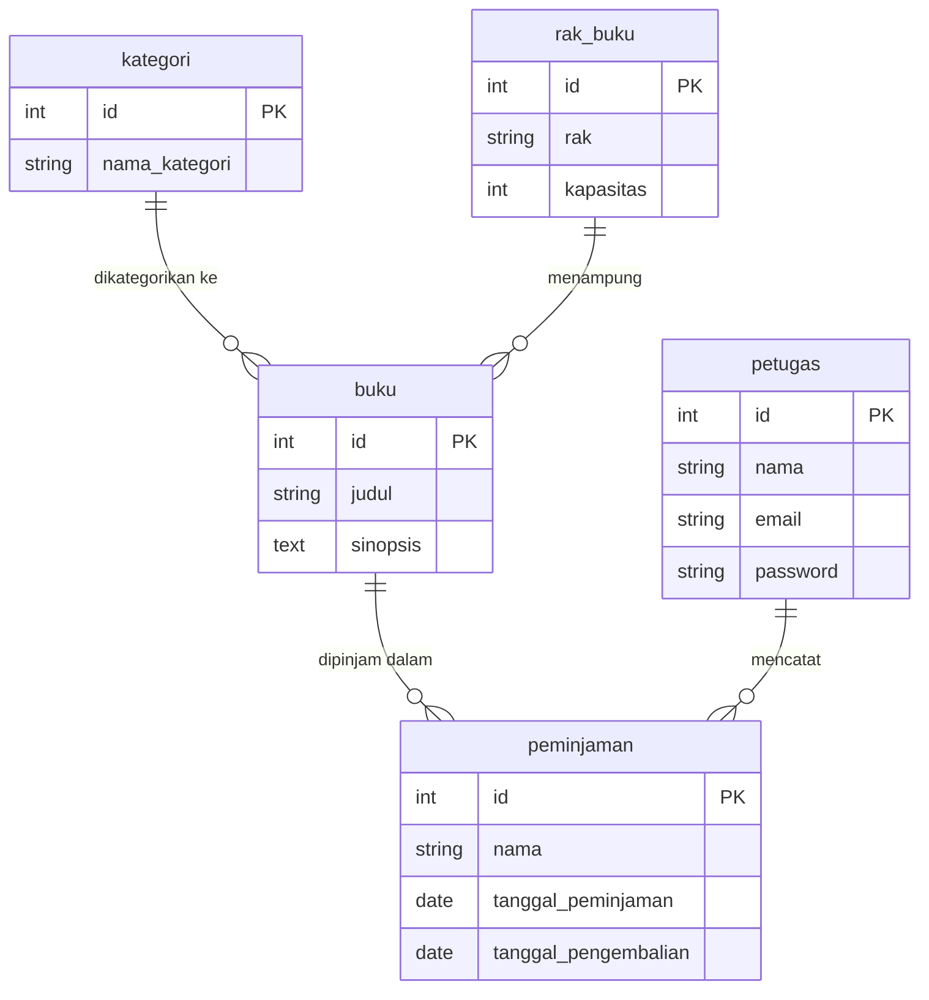

```mermaid
erDiagram
    buku {
        int id PK
        string judul
        text sinopsis
    }
    kategori {
        int id PK
        string nama_kategori
    }
    rak_buku{
        int id PK
        string rak
        int kapasitas
    }
    petugas {
        int id PK
        string nama
        string email
        string password
    }
    peminjaman {
        int id PK
        string nama
        date tanggal_peminjaman
        date tanggal_pengembalian
    }

    kategori ||--o{ buku : "dikategorikan ke"
    rak_buku ||--o{ buku : "menampung"
    buku ||--o{ peminjaman : "dipinjam dalam"
    petugas ||--o{ peminjaman : "mencatat"
```
    